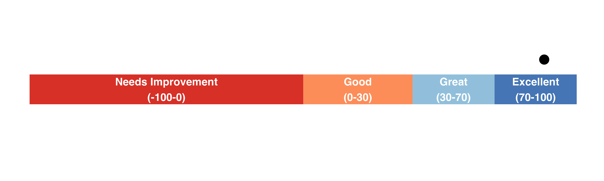

# DATA OVERVIEW

```{r,include = FALSE}
#load libraries
require(tidyverse)
require(sf)
require(kableExtra)
```

```{r, message=FALSE,include = FALSE}
dataq4<-readRDS("data/2024_2025/survey_data_q4_2425.rds")
dataq3<-readRDS("data/2024_2025/survey_data_q3_2425.rds")
dataq2<-readRDS("data/2024_2025/survey_data_q2_2425.rds")
dataq1<-readRDS("data/2024_2025/survey_data_q1_2425.rds")

engage_dataq4_s<-dataq4$engagement_short
engage_dataq4_l<-dataq4$engagement_long

engage_dataq3_s<-dataq3$engagement_short
engage_dataq3_l<-dataq3$engagement_long

engage_dataq2_s<-dataq2$engagement_short
engage_dataq2_l<-dataq2$engagement_long

engage_dataq1_s<-dataq1$engagement_short
engage_dataq1_l<-dataq1$engagement_long

rm(dataq4)
rm(dataq3)
rm(dataq2)
rm(dataq1)


# we need to match questions by short and long

#make a function to extract labels and colnames 

get_labels<-function(data){
  column_labels <- sapply(data, function(col) as.character(attr(col, "label")))
questions_s_q1<-tibble(column = colnames(data), 
           labels = column_labels)
}

questions_s_q1<-get_labels(data = engage_dataq1_s)
questions_l_q1<-get_labels(data = engage_dataq1_l)
questions_s_q2<-get_labels(data = engage_dataq2_s)
questions_l_q2<-get_labels(data = engage_dataq2_l)
questions_s_q3<-get_labels(data = engage_dataq3_s)
questions_l_q3<-get_labels(data = engage_dataq3_l)
questions_s_q4<-get_labels(data = engage_dataq4_s)
questions_l_q4<-get_labels(data = engage_dataq4_l)

#quick function to create a table that 
#has a master set of the questions and column names

get_master<-function(short, long){
  cols_keep<-intersect((short$labels), 
                     (long$labels))
  #now we filter for only those labels 
q_keep_s<-short %>%
  filter(labels %in% cols_keep) %>%
  rename(column_short=column)
q_keep_l<-long %>%
  filter(labels %in% cols_keep) %>%
  rename(column_long=column)

master_key_ques<-left_join(q_keep_s, q_keep_l, by = "labels")

return(master_key_ques)
}
master_key_ques<-get_master(short = questions_s_q1, 
                            long = questions_l_q1)
master_key_ques_q2<-get_master(short = questions_s_q2, 
                               long = questions_l_q2)
master_key_ques_q3<-get_master(short = questions_s_q3, 
                               long = questions_l_q3)
master_key_ques_q4<-get_master(short = questions_s_q4, 
                               long = questions_l_q4)


#now cut down  datasets to just the common questions
#and combine them

master_join_quart<-function(short,long, masterkey){
  engage_dataq_s<-short %>%
  dplyr::select(all_of(masterkey$column_short))

  engage_dataq_l<-long %>%
  dplyr::select(all_of(masterkey$column_long))
  
  #now change out the colnames to reflect just one format

for(i in seq_along(engage_dataq_s)){

  if(colnames(engage_dataq_s)[i] == colnames(engage_dataq_l)[i]){
    
  }else{
    colnames(engage_dataq_s)[i] <- masterkey$column_long[masterkey$column_long ==  colnames(engage_dataq_l)[i]]
  }
}

joined_full_q1<-rbind(engage_dataq_s,engage_dataq_l)

return(joined_full_q1)

}

final_join_q1<-master_join_quart(short = engage_dataq1_s,
                  long = engage_dataq1_l,masterkey = master_key_ques)

final_join_q2<-master_join_quart(short = engage_dataq2_s,
                  long = engage_dataq2_l,masterkey = master_key_ques_q2)

final_join_q3<-master_join_quart(short = engage_dataq3_s,
                  long = engage_dataq3_l,masterkey = master_key_ques_q3)

final_join_q4<-master_join_quart(short = engage_dataq4_s,
                  long = engage_dataq4_l,masterkey = master_key_ques_q4)


#get some basic numbers up front for Q4

total_responders<-nrow(final_join_q4)

engage_nps_q4<-final_join_q4 %>%
  dplyr::select(Q20)


total_NPS<-engage_nps_q4 %>%
  group_by(Q20) %>%
  count() %>%
  rename(NPS_question = Q20,
         Responders = n) %>%
  ungroup()  %>%
  mutate(Response_percent = 100 - round(100*(Responders/sum(Responders)),1))


NA_peeps<-total_NPS %>%
  filter(is.na(NPS_question))

#calculate the total number of people responding to the NPS question 
responded_nps_total<-total_responders-NA_peeps$Responders


#add a column for 
final_join_q4<-final_join_q4 %>%
  mutate(Quarter = "Quarter 4")

final_join_q3<-final_join_q3 %>%
  mutate(Quarter = "Quarter 3")

final_join_q2<-final_join_q2 %>%
  mutate(Quarter = "Quarter 2")

final_join_q1<-final_join_q1 %>%
  mutate(Quarter = "Quarter 1")
```

```{r, message=FALSE,include = FALSE}
#get net promoter score for all


get_col_nps<-function(x){
  #first extract labels for the columns
column_labels <- sapply(x, function(col) as.character(attr(col, "label")))
questions<-tibble(column = colnames(x), 
           labels = column_labels) %>%
  mutate(labels = gsub("\\s+", " ", labels))
#now find which column has the NPS question
NPS_col<-which(str_detect(questions$labels, 
                 "likely are you to recommend New Worlds Reading to others?"))
if(length(NPS_col)>1){
  multicols<-questions[NPS_col,]
  singcol<-multicols %>%
    mutate(str_count = str_count(column)) %>%
    filter(str_count == min(str_count))
  NPS_col<-singcol$column
  }else{
  print("Only one type of question for NPS")
    NPS_col<-colnames(x)[NPS_col]
  }
return(NPS_col)}

NPS_colQ4<-get_col_nps(final_join_q4)
NPS_colQ3<-get_col_nps(final_join_q3)
NPS_colQ2<-get_col_nps(final_join_q2)
NPS_colQ1<-get_col_nps(final_join_q1)

calc_nps_total<-function(x,y){

  NPS_labels<-x %>%
  dplyr::select(all_of(y)) %>%
  mutate(across(everything(), ~ as.numeric(.))) %>%
  mutate( NPS_CAT = ifelse(.data[[y]] >= 9,
                           "Promoter",
                           ifelse(.data[[y]] <= 6,"Detractor",
                                  "Passive"))) 
  
  if("Detractor" %in% NPS_labels$NPS_CAT){
    print("No detractors")
    
    Total_NPS = NPS_labels%>%
  drop_na() %>%
  group_by(NPS_CAT) %>%
  summarise(n = n()) %>%
  ungroup() %>%
  mutate(prop = 100*(n/sum(n))) %>%
  pivot_wider(id_cols =!n,names_from = "NPS_CAT", values_from = "prop") %>%
  mutate(NPS = round(Promoter - Detractor,2)) 
return(Total_NPS)
  }else{
    Total_NPS = NPS_labels%>%
  drop_na() %>%
  group_by(NPS_CAT) %>%
  summarise(n = n()) %>%
  ungroup() %>%
  mutate(prop = 100*(n/sum(n))) %>%
  pivot_wider(id_cols =!n,names_from = "NPS_CAT", values_from = "prop") %>%
  mutate(NPS = round(Promoter)) 
return(Total_NPS)
  }

}

Total_NPSQ4<-calc_nps_total(final_join_q4, y = NPS_colQ4)
Total_NPSQ3<-calc_nps_total(final_join_q3, y = NPS_colQ3)
Total_NPSQ2<-calc_nps_total(final_join_q2, y = NPS_colQ2)
Total_NPSQ1<-calc_nps_total(final_join_q1, y = NPS_colQ1)

Q4_totals<-final_join_q4 %>%
  summarise(total_n = n(),
            total_na_q20 = sum(is.na(Q20)),
            NPS = Total_NPSQ3$NPS)

Q3_totals<-final_join_q3 %>%
  summarise(total_n = n(),
            total_na_q20 = sum(is.na(Q20)),
            NPS = Total_NPSQ3$NPS)

Q2_totals<-final_join_q2 %>%
  summarise(total_n = n(),
            total_na_q20 = sum(is.na(Q20)),
            NPS = Total_NPSQ2$NPS)

Q1_totals<-final_join_q1 %>%
  summarise(total_n = n(),
            total_na_q20 = sum(is.na(Q20)),
            NPS = Total_NPSQ1$NPS)

Q4_totals<-Q4_totals %>%
  mutate(Quarter = 4)

Q3_totals<-Q3_totals %>%
  mutate(Quarter = 3)

Q2_totals<-Q2_totals %>%
  mutate(Quarter = 2)

Q1_totals<-Q1_totals %>%
  mutate(Quarter = 1)

temporal_nps<-rbind(Q1_totals,Q2_totals, Q3_totals,Q4_totals) 

#change in respondents q3 to q4
total_change = Q4_totals$total_n - Q3_totals$total_n

#difference in NPS 
diff_nps <- (temporal_nps$NPS[temporal_nps$Quarter == 4]-temporal_nps$NPS[temporal_nps$Quarter == 3])

perc_diff<-round(100*(diff_nps/temporal_nps$NPS[temporal_nps$Quarter == 4]),1)

#change in respondents
total_change = Q4_totals$total_n - Q3_totals$total_n

total_NPS<-final_join_q3 %>%
  drop_na(Q20)%>%
  group_by(Q20) %>%
  count() %>%
  rename(NPS_question = Q20,
         Responders = n) %>%
  ungroup() %>%
  mutate(Response_percent = round(100*(Responders/sum(Responders)),1))

```

```{r,include=FALSE}
#calculating percent of questions answered 
percents<- final_join_q4 %>%
  select(starts_with("Q")) %>%
  mutate(percent_na = rowMeans(is.na(.)) * 100) %>%
  ungroup()
percentabove50=100*round(length(which(percents$percent_na>50))/nrow(percents),1)
```

```{r, echo=FALSE, include=FALSE, warning=FALSE, cache=FALSE}
#NPS score graph

require(tidyverse)

#NPS plot 

NPS_Scale<-data.frame(
  x_mas= "NPS_score",
  x = c("Needs Improvement\n(-100-0)",
        "Good\n(0-30)",
        "Great\n(30-70)",
        "Excellent\n(70-100)"),
  perc = c(50, 15, 20,15),
  perc_label = c(25, 60, 77.5, 92.5)
  
)

Ourdata = data.frame(x_mas= "NPS_score",y = 50+100*((88.14/100)/2))

p<-ggplot(data = NULL) +
  geom_col(data = NPS_Scale,
           aes(y = x_mas, x = perc, fill = x),
           width = 0.2) +
  geom_text(data = NPS_Scale,
            aes(y = x_mas, x = perc_label, label = x), 
            color = "white", size = 4.5, fontface = "bold", hjust = 0.5) +
  scale_fill_manual(values = rev(c("#D73027", "#FC8D59","#91BFDB","#4575B4"))) +
  geom_point(data = Ourdata, aes(y = 1.2, x = y), size = 5) +
  theme_minimal() +
  theme(axis.title = element_blank(), 
        axis.text.x = element_blank(),
        axis.text.y = element_blank(), 
        legend.title = element_blank(),
        legend.position = "none",
        panel.grid.major = element_blank(),
        panel.grid = element_blank(),
        plot.margin = unit(c(0, 0, 0, 0),units = "pt")) +   # remove margins
  coord_cartesian(clip = "off")  # avoid clipping labels

# Save tightly cropped
ggsave("nps_bar_dotq4.png", p,
       width = 10, height = 3, dpi = 500,
       bg = "transparent")  # optional: transparent background

```

## NPS Score: `{r} Total_NPSQ3$NPS`

::: {style="height: 120px; overflow: hidden; display: flex; justify-content: center;"}

:::

## Quarter 4 Overview

-   Total survey respondents: `{r} total_responders`
    -   `{r} responded_nps_total` (`{r} NA_peeps$Response_percent`%) respondents answered the NPS question.
    -   `{r} length(which(percents$percent_na>50))` (`{r} percentabove50`%) respondents answered 50% or more of the survey questions.
-   Overall NPS: `{r} Total_NPSQ3$NPS`

## Data overview for Quarter 4 compared to Quarter 3

-   There were `{r} abs(total_change)` `{r} if (total_change >= 0) "more" else "less"` respondents.
-   The NPS score saw an `{r} if (diff_nps >= 0) "increase" else "decrease"` of `{r} (diff_nps)` (`{r} perc_diff`%) (Table 1).

```{r, echo=FALSE, include=TRUE, warning=FALSE, cache=FALSE}
#| out-width: 100%
#| #| label: fig_histogram
#| fig-cap: "Number of survey responses by month"

time_q4<-final_join_q4 %>%
 dplyr::select(RecordedDate, Quarter)
time_q3<-final_join_q3 %>%
 dplyr::select(RecordedDate, Quarter)
time_q2<-final_join_q2 %>%
 dplyr::select(RecordedDate, Quarter) 
time_q1<-final_join_q1 %>%
 dplyr::select(RecordedDate, Quarter) 


response_time <- rbind(time_q2, time_q1, time_q3, time_q4) %>%
  dplyr::select(RecordedDate, Quarter) %>%
  mutate(week = paste(year(RecordedDate), sprintf("%02d", week(RecordedDate)), sep = "-"),
         month = floor_date(RecordedDate, "month"),
         month_label = factor(format(month, "%b"), 
                              levels = month.abb),
         year_month = format(month, "%Y-%m")) %>%
  group_by(Quarter, year_month) %>%
  summarise(n = n(), .groups = "drop") %>%
  ggplot() +
  geom_col(aes(x = year_month, y = n, fill = Quarter)) +
  theme_light() +
  labs(y = "No. of Survey Responses") +
  theme(legend.title = element_blank(),
        axis.title.x = element_blank(),
        axis.text.x = element_text(angle = 40, vjust = 0.5)) +
  scale_y_continuous(expand = c(0,0)) +
  scale_fill_viridis_d(option = "E")
response_time
```

```{r, echo=FALSE, include=TRUE, warning=FALSE, cache=FALSE}

kableExtra::kable(
  temporal_nps, "html",
  col.names = c("Total Respondents", "No response (NPS)", "Net Promoter Score", "Quarter"),
  align = "c",
  caption = "Numbers on: survey response, NPS question not answered, and net promoter score across quarters"
) %>%
  kableExtra::kable_styling(latex_options = c("striped", "HOLD_position"))

```

# DATA DIVE

```{r, include=FALSE}
languages<-final_join_q4 %>%
  group_by(UserLanguage) %>%
  count()
es_numb<- languages %>% filter(UserLanguage == "ES")
en_numb<- languages %>% filter(UserLanguage == "EN")


#also calculate NPS by language
calc_nps_total(x = final_join_q4 %>% filter(UserLanguage == "ES") %>%
                 select(Q20), y = NPS_colQ3)
calc_nps_total(x = final_join_q4 %>% filter(UserLanguage == "EN") %>%
                 select(Q20), y = NPS_colQ3)

```

Out of `{r} total_responders` respondents, `{r} es_numb$n` used the Spanish version of the survey while `{r} en_numb$n` used the English version.

```{r, include=FALSE}
#select columns for question 2
q2q1<-final_join_q1 %>%
  select(starts_with("Q2_"))
q2q2<-final_join_q2 %>%
  select(starts_with("Q2_"))
q2q3<-final_join_q3 %>%
  select(starts_with("Q2_"))
q2q4<-final_join_q4 %>%
  select(starts_with("Q2_"))

combined<-rbind(q2q4) 
#now change column names to the answers

colnames<-lapply(seq_along(combined), function(x){
  return(unique(na.omit(combined[,x])))
})
for(i in seq_along(colnames)){
  if(nrow(colnames[[i]])>1){
    colnames(combined)[i]<-"Other"
  }else{
     colnames(combined)[i]<-colnames[[i]]
  }

}


total_response_values<-combined %>%
  dplyr::select(-`Other (please describe):`) %>%
  mutate_all(., ~ifelse(is.na(.), ., 1)) %>%
  mutate(ID = 1:nrow(.)) %>%
  pivot_longer(cols = c(`Information about New Worlds Reading Initiative`,
                        `New Worlds Reading Event Activities`,
                        Meal,
                        Other), names_to = "Selection", values_to = "total") %>%
  drop_na() %>%
  group_by(Selection) %>%
  summarise(n = n())
```

```{r, echo=FALSE, include=TRUE, warning=FALSE, cache=FALSE}

kableExtra::kable(total_response_values,"html",escape = FALSE,
                  col.names = c("Possible choices", "Total"),
                  align = "c",
                  caption = "Answers to the question, What was the favorite part of this event?") %>%
  kableExtra::column_spec(1, width = "4cm") %>%
  kableExtra::column_spec(2, width = "4cm")  %>%
  kableExtra::kable_styling(latex_options = c("striped","HOLD_position"))
```

```{r, include=FALSE}
table_answer<-combined %>%
  dplyr::select(-`Other (please describe):`) %>%
  mutate_all(., ~ifelse(is.na(.), ., 1)) %>%
  mutate(ID = 1:nrow(.)) %>%
  group_by(`Information about New Worlds Reading Initiative`,`New Worlds Reading Event Activities`,Meal,Other) %>%
  count() %>%
 # Add completeness column to count non-NA values per row
mutate(completeness = rowSums(across(-n) == 1, na.rm = TRUE)) %>%
# Arrange by completeness first, then prioritize column order
  arrange(desc(completeness), 
          desc(`Information about New Worlds Reading Initiative`), 
          desc(`New Worlds Reading Event Activities`), 
          desc(Meal), 
          desc(Other)) %>%
  select(-completeness) %>%
  ungroup()%>% # Optionally remove the completeness column
  # Replace all 1s with a checkmark symbol
mutate(across(-n, ~ ifelse(. == 1, "&#10003;", .)))

```

```{r, echo=FALSE, include=TRUE, warning=FALSE, cache=FALSE}

kableExtra::kable(table_answer,"html",escape = FALSE,
                  col.names = c("Information about New Worlds Reading Initiative",
                                "New Worlds Reading Event Activities", "Meal", "Other", "Total"),
                  align = "c",
                  caption = "Combinations of answers to the question, What was the favorite part of this event?") %>%
  kableExtra::column_spec(1, width = "4cm") %>%
  kableExtra::column_spec(2, width = "4cm")  %>%
  kableExtra::kable_styling(latex_options = c("striped","HOLD_position"))
```
