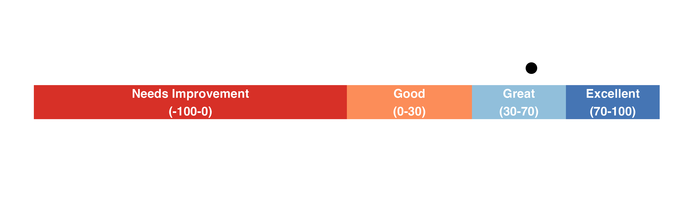
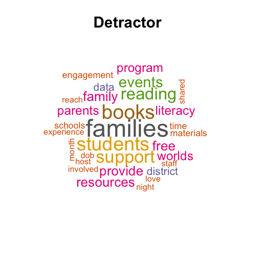
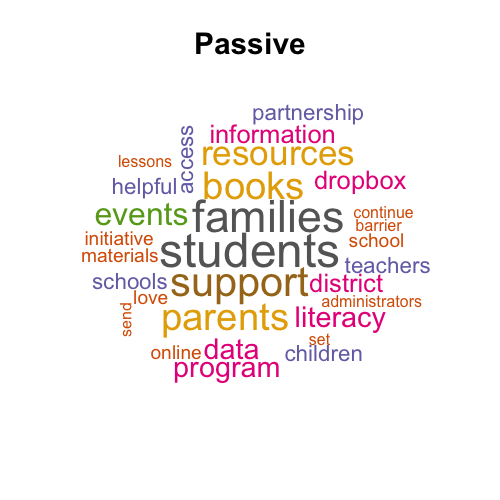

```{r, echo=FALSE, include=FALSE, warning=FALSE, cache=FALSE}
require(tidyverse)
require(tidytext)
require(wordcloud)
require(RColorBrewer)
require(reactable)
require(reactablefmtr)


DIS_Data<-readRDS("data/DIS_POC_Survey2425.rds")
DIS_Data<-DIS_Data %>%
  filter(!is.na(Q4))

labels <- lapply(DIS_Data, function(col) attr(col, "label"))

#first calculate NPS and customer satisfaction for overall
NPS<-DIS_Data %>%
  count(Q4_NPS_GROUP) %>%
  ungroup() %>%
  mutate(perc = round(100*(n/sum(n)))) %>%
  select(-n) %>%
  pivot_wider(names_from = Q4_NPS_GROUP, values_from = perc) %>%
  mutate(NPS = Promoter - Detractor)

cs_score<-DIS_Data %>%
  mutate(satisfied  = ifelse(Q4 %in% c(8,9,10), "Satisfied", "Not")) %>%
  count(satisfied) %>%
  ungroup() %>%
  mutate(cust_perc = round(100*n/sum(n))) %>%
  filter(satisfied == "Satisfied")

#now calculate for ELC
NPS_ELC<-DIS_Data %>%
  filter(str_detect(Q2, "ELC")) %>%
  count(Q4_NPS_GROUP) %>%
  ungroup() %>%
  mutate(perc =  round(100*(n/sum(n)))) %>%
  filter(Q4_NPS_GROUP == "Promoter")


cs_scoreELC<-DIS_Data %>%
  mutate(satisfied  = ifelse(Q4 %in% c(8,9,10), "Satisfied", "Not")) %>%
   filter(str_detect(Q2, "ELC")) %>%
  count(satisfied) %>%
  ungroup() %>%
  mutate(cust_perc = round(100*n/sum(n))) %>%
  filter(satisfied == "Satisfied")

#Calcualte for non-ELC
NPS_NONELC<-DIS_Data %>%
  drop_na(Q4) %>%
  filter(!str_detect(Q2, "ELC")) %>%
  count(Q4_NPS_GROUP) %>%
  mutate(perc =  round(100*(n/sum(n)))) %>%
    select(-n) %>%
  pivot_wider(names_from = Q4_NPS_GROUP, values_from = perc) %>%
  mutate(NPS = Promoter - Detractor)

cs_scorenonELC<-DIS_Data %>%
  mutate(satisfied  = ifelse(Q4 %in% c(8,9,10), "Satisfied", "Not")) %>%
   filter(!str_detect(Q2, "ELC")) %>%
  count(satisfied) %>%
  ungroup() %>%
  mutate(cust_perc = round(100*n/sum(n))) %>%
  filter(satisfied == "Satisfied")


```

```{r, echo=FALSE, include=FALSE, warning=FALSE, cache=FALSE}
#NPS score graph

require(tidyverse)

#NPS plot 

NPS_Scale<-data.frame(
  x_mas= "NPS_score",
  x = c("Needs Improvement\n(-100-0)",
        "Good\n(0-30)",
        "Great\n(30-70)",
        "Excellent\n(70-100)"),
  perc = c(50, 15, 20,15),
  perc_label = c(25, 60, 77.5, 92.5)
  
)

Ourdata = data.frame(x_mas= "NPS_score",y = 50+100*((59/100)/2))

p<-ggplot(data = NULL) +
  geom_col(data = NPS_Scale,
           aes(y = x_mas, x = perc, fill = x),
           width = 0.2) +
  geom_text(data = NPS_Scale,
            aes(y = x_mas, x = perc_label, label = x), 
            color = "white", size = 5, fontface = "bold", hjust = 0.5) +
  scale_fill_manual(values = rev(c("#D73027", "#FC8D59","#91BFDB","#4575B4"))) +
  geom_point(data = Ourdata, aes(y = 1.2, x = y), size = 5) +
  theme_minimal() +
  theme(axis.title = element_blank(), 
        axis.text = element_blank(),
        legend.title = element_blank(),
        legend.position = "none",
        panel.grid.major = element_blank(),
        panel.grid = element_blank(),
        plot.margin = unit(c(0, 0, 0, 0),units = "pt")) +   # remove margins
  coord_cartesian(clip = "off")  # avoid clipping labels

# Save tightly cropped
ggsave("nps_bar_dot.png", p,
       width = 10, height = 3, dpi = 300,
       bg = "transparent")  # optional: transparent background

```
<div style="height: 100px; overflow: hidden; display: flex; justify-content: center;">
  
</div>

# Overview

There was a total of `{r} nrow(DIS_Data)` responders for the District POC survey. The overall NPS was `{r} NPS$NPS` while the customer satisfaction rate was `{r} cs_score$cust_perc`%.

The NPS for non ELC District POC was `{r} NPS_NONELC$NPS ` and the customer satisfaction rate was `{r} cs_scorenonELC$cust_perc`%.

The NPS for ELCs was `{r} NPS_ELC$perc ` and the customer satisfaction rate was `{r} cs_scoreELC$cust_perc`%.

# Customer satisfaction rate info
We considered responses of 8-10 for the NPS questions as satisfied customers and calculated the percentage of those selecting 8-10 as the customer satisfaction percentage.

# Flyer info

```{r, echo=FALSE, include=FALSE, warning=FALSE, cache=FALSE}
flyer_levels<-DIS_Data %>%
  count(ResponseId,Q2, Q8, Q9) %>%
  select(-n)


flyer_levels1<-DIS_Data %>%
  select(ResponseId,which(str_detect(colnames(DIS_Data), "Q10_"))) %>%
  filter(is.na(Q10_3_TEXT)) %>%
  pivot_longer(cols = starts_with("Q10_"), names_to = "Answerselect",
               values_to = "AnswerQ10") %>%
  drop_na(AnswerQ10) %>%
  select(-Answerselect)

flyer_levels2<-DIS_Data %>%
  select(ResponseId,which(str_detect(colnames(DIS_Data), "Q11_"))) %>%
  filter(is.na(Q11_4_TEXT)) %>%
  pivot_longer(cols = starts_with("Q11_"), names_to = "Answerselect", 
               values_to = "AnswerQ11") %>%
  drop_na(AnswerQ11) %>%
  select(-Answerselect)

flyertotal<-left_join(flyer_levels, flyer_levels1, by = "ResponseId") %>%
  left_join(., flyer_levels2, by = "ResponseId")

```


```{r, echo=FALSE, include=TRUE, warning=FALSE, cache=FALSE}

flyertotal %>%
  count(Q8) %>%
  mutate(Q8 = ifelse(is.na(Q8), "No Answer", Q8)) %>%
  ggplot(.) +
  geom_col(aes(x = n, y = Q8)) +
  geom_text(aes(x = n, y = Q8,label = n), size = 10,
            color = 'black',nudge_x = 2.5) +
  theme_minimal() + 
  labs(title = "Did you receive flyers\nin the 2024–2025 school year?") +
  theme(axis.text = element_text(size = 14),
        axis.title = element_blank(), 
        plot.title = element_text(size = 16)) 

flyertotal %>%
  filter(Q8 == "Yes") %>%
  mutate(Q9 = ifelse(is.na(Q9), "No answer", Q9)) %>%
  mutate(AnswerQ10 = ifelse(is.na(AnswerQ10), "No answer", AnswerQ10)) %>%
  count(Q9, AnswerQ10)  %>%
  group_by(Q9) %>%
  mutate(perc = round(100 * (n / sum(n)))) %>%
  rename(`Were there enough flyers, too few, too many??` = Q9,
         `Did schools share any successes around the flyers?` = AnswerQ10) %>%
  ggplot() +
  geom_col(aes(
    x = `Were there enough flyers, too few, too many??`,
    y = perc,
    fill =  `Did schools share any successes around the flyers?`
  )) +
  theme_bw() +
  theme(legend.position = "top",
        legend.text = element_text(size = 14),
        legend.title = element_text(size = 16),
        legend.title.position = "top",
        axis.text.x = element_text(size = 14),
        axis.title.x = element_text(size = 16),
        plot.title = element_text(size = 16)) +
  scale_fill_viridis_d(option = "E")
```

# Text Feedback

We generated word cloud based for each NPS group (Promoters, Detractors, and Passives) using all the answers across questions 5, 6, 7. These questions were:

Question 5: We would love to hear more about why you rated your experience with us the way you did. What specific aspects influenced your rating?

Question 6: What do you like the most about New Worlds Reading and our partnership?

Question 7: What can we do to better serve you and/or families in your district?

```{r, echo=FALSE, include=FALSE, warning=FALSE, cache=FALSE}
#generate word cloud by NPS group and save them for use with table

combined_word_cloud<-DIS_Data %>%
  select(Q4_NPS_GROUP, Q5, Q6, Q7) %>%
  mutate(full_comm = paste(Q5, Q6,Q7, sep = " ")) %>%
  mutate(full_comm = str_replace_all(full_comm, "NA", "")) %>%
  mutate(full_comm = str_squish(full_comm))  %>%
  select(Q4_NPS_GROUP, full_comm) %>%
   unnest_tokens(word, full_comm) %>%
    anti_join(stop_words, by = "word") %>%
    count(Q4_NPS_GROUP,word, sort = TRUE) %>%
   group_split(Q4_NPS_GROUP) # returns a list, one df per group

#make three word clouds based on NPS group

save_word_clouds <- function(word_df, group_name) {
  safe_group <- gsub("[^a-zA-Z0-9]", "_", group_name)
  filename <- paste0("wrd_wordcloud", "_", safe_group, ".png")

  png(filename, width = 500, height = 500)
  par(mar = c(0, 0, 6, 0))
  wordcloud(
    words = word_df$word,
    freq = word_df$n,
    min.freq = 2, 
    max.words = 30,res=300,
    scale = c(4, 0.8),
    colors = brewer.pal(8, "Dark2"),
    random.order = FALSE
    )
   title(main = group_name, cex.main = 2.5)
  dev.off()

  message("Saved: ", filename)
}
group_names<-unique(DIS_Data$Q4_NPS_GROUP)

safe_group<-gsub("[^a-zA-Z0-9]", "_", group_names[1])
filename <- paste0("wrd_wordcloud", "_", safe_group, ".png")

walk2(combined_word_cloud, group_names, ~save_word_clouds(.x, .y))
```


<div style="overflow-x: auto; white-space: nowrap;">
  
  
  
</div>
```{r, echo=FALSE, include=TRUE, warning=FALSE, cache=FALSE, message=FALSE}


DIS_Data2<- DIS_Data %>%
  filter(Q4_NPS_GROUP == "Promoter") %>%
  select(Q2,Q4_NPS_GROUP, Q5, Q6, Q7)


# each fragment is searched for separately with match size >= # of fragments
# size > length happens when something like city(_id)? returns two positive matches
js_filter <-  JS(
  "function(rows, columnId, filterValue) {
      // rows = [{'table': 1, 'field': 'city'}, {'table': 2, 'field': 'city city_id'}] 
      // columnId = 'field'
      // filterValue = 'city(_id)?'
      try {
        const pattern = filterValue.split(' ')
        const find = RegExp(`(${pattern.join('|')})+`, 'gi')
        return rows.filter(
          row => new Set(row.values[columnId].match(find)).size >= pattern.length
        )
      } catch(e) {
          return rows
      }
       
  }"
)

# highlight all fragment occurrences string matches
js_match_style <- JS(
  "function(cellInfo) {
    try {
      let filterValue = cellInfo.filterValue
      let pattern = filterValue.split(' ').filter(n => n).sort().join('|')
      let regexPattern = new RegExp('(' + pattern + ')', 'gi')
      let replacement = '<span style=\"color:black;font-weight:bold;\">$1</span>'
      return cellInfo.value.replace(regexPattern, replacement)
    } catch(e) {
        return cellInfo.value
    }
  }"
)


reactable(DIS_Data2,
          searchable = TRUE,highlight = TRUE,
            columns = list(
              Q2 = colDef(name = "County/ELC", filterable = T,
                          filterMethod = js_filter,
                          cell = js_match_style,
                          sortable = T),
              Q4_NPS_GROUP = colDef(name = "NPS Group"),
              Q5 = colDef(name = "Question 5",
                          filterable = TRUE,
                          filterMethod = js_filter,
                          cell = js_match_style,
                          html = TRUE,
                          sortable = F),
              Q6 = colDef(name = "Question 6",
                          filterable = TRUE,
                          filterMethod = js_filter,
                          cell = js_match_style,
                          html = TRUE,
                          sortable = F),
              Q7 = colDef(
                          name = "Question 7",
                          filterable = TRUE,
                          filterMethod = js_filter,
                          cell = js_match_style,
                          html = TRUE,
                          sortable = F)


            ))


```

