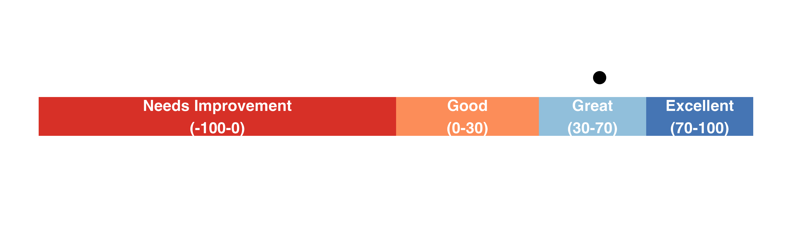

```{r, echo=FALSE, include=FALSE, warning=FALSE, cache=FALSE}
require(tidyverse)
regional_Data<-readRDS("data/Regional_Partner_Survey2425.rds")
responders<-regional_Data %>%
  filter(!is.na(Q5_NPS_GROUP))  %>%
  nrow()
#calculate NPS
NPS_reg<-regional_Data %>%
  filter(!is.na(Q5_NPS_GROUP)) %>%
  count(Q5_NPS_GROUP) %>%
  ungroup() %>%
  mutate(perc = n/sum(n)) %>% 
  filter(Q5_NPS_GROUP == "Promoter") %>%
  mutate(NPS = round(perc * 100))

#calcualte customer satisfaction
cust_satis<-regional_Data %>%
  filter(!is.na(Q5_NPS_GROUP)) %>%
  mutate(satisfied  = ifelse(Q5 %in% c(8,9,10), "Satisfied", "Not")) %>%
  count(satisfied) %>%
  ungroup() %>%
  mutate(cust_perc = round(100*n/sum(n))) %>%
  filter(satisfied == "Satisfied")

#no detractors so the NPS is just the percentage of promotors


```
```{r, echo=FALSE, include=FALSE, warning=FALSE, cache=FALSE}
#NPS score graph

require(tidyverse)

#NPS plot 

NPS_Scale<-data.frame(
  x_mas= "NPS_score",
  x = c("Needs Improvement\n(-100-0)",
        "Good\n(0-30)",
        "Great\n(30-70)",
        "Excellent\n(70-100)"),
  perc = c(50, 15, 20,15),
  perc_label = c(25, 60, 77.5, 92.5)
  
)

Ourdata = data.frame(x_mas= "NPS_score",y = 50+100*((57/100)/2))

p<-ggplot(data = NULL) +
  geom_col(data = NPS_Scale,
           aes(y = x_mas, x = perc, fill = x),
           width = 0.2) +
  geom_text(data = NPS_Scale,
            aes(y = x_mas, x = perc_label, label = x), 
            color = "white", size = 5, fontface = "bold", hjust = 0.5) +
  scale_fill_manual(values = rev(c("#D73027", "#FC8D59","#91BFDB","#4575B4"))) +
  geom_point(data = Ourdata, aes(y = 1.2, x = y), size = 5) +
  theme_minimal() +
  theme(axis.title = element_blank(), 
        axis.text = element_blank(),
        legend.title = element_blank(),
        legend.position = "none",
        panel.grid.major = element_blank(),
        panel.grid = element_blank(),
        plot.margin = unit(c(0, 0, 0, 0),units = "pt")) +   # remove margins
  coord_cartesian(clip = "off")  # avoid clipping labels

# Save tightly cropped
ggsave("nps_bar_dot.png", p,
       width = 10, height = 3, dpi = 300,
       bg = "transparent")  # optional: transparent background

```


# Overview

We had a total of `{r} responders` responses to the regional partner annual survey. The overall NPS was `{r} NPS_reg$NPS ` with a customer satisfaction rate of `{r} cust_satis$cust_perc`%.

# Customer satisfaction rate info
We considered responses of 8-10 for the NPS questions as satisfied customers and calculated the percentage of those selecting 8-10 as the customer satisfaction percentage.

# Survey content
Below is a table showing each partner, their NPS score, and their fill in the blank answers to questions regarding why they chose their score and what sort of improvements they would like:
```{r, echo=FALSE, include=TRUE, warning=FALSE, cache=FALSE, message=FALSE}
require(reactable)
require(reactablefmtr)

paste(attr(regional_Data$Q7, "label"))

regional_table <- regional_Data %>%
  select(-Q5_NPS_GROUP) %>%
  select(Q2, Q5, Q6, Q7) %>%
  rename(
    Partner = Q2,
    `NPS Score` = Q5
  ) %>%
  rename_with(~ attr(regional_Data$Q6, "label"), .cols = Q6) %>%
  rename_with( ~ attr(regional_Data$Q7, "label"), .cols = Q7)

reactable(regional_table,
          filterable = TRUE,
          sortable = TRUE,
          wrap = TRUE)

```
